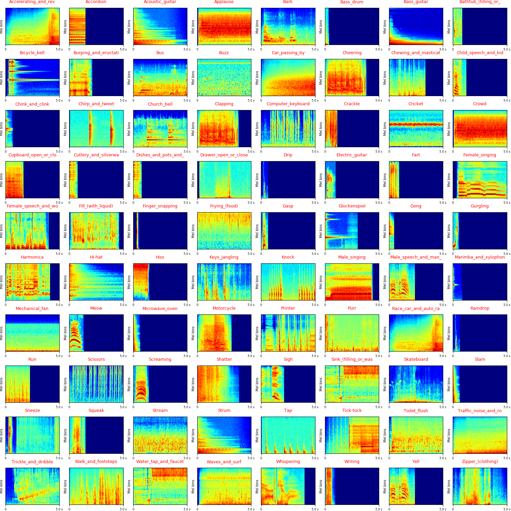
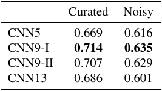
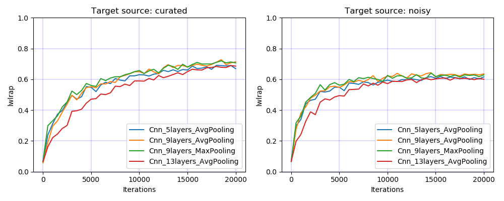

# DCASE2019 Task2 Audio tagging with noisy labels and minimal supervision

DCASE2019 Task2 Audio tagging with noisy labels and minimal supervision is a task to evaluate systems for multi-label audio tagging using a small set of manually-labeled data, and a larger set of noisy-labeled data, under a large vocabulary setting. More description of this task can be found in http://dcase.community/challenge2019/task-audio-tagging.

## DATASET
The dataset can be downloaded from http://dcase.community/challenge2019/task-audio-tagging. The Training part consists of manually-labeled (curated) data from Freesound Dataset (FSD) and noisy-labeled data from Yahoo Flickr Creative Commons 100M dataset (YFCC). The testing data consists of audio from FSD dataset. The sampling rate of audio recordings are all 44.1 kHz. There are 80 sound classes in the vocabulary. The statistic of the data is shown below:

|                 | Audio num. |   Duration   | Source |
|:---------------:|:----------:|:------------:|:------:|
| Train (curated) |    4970    | 0.3 s - 30 s |   FSD  |
|  Train (noisy)  |    19815   |  1 s - 15 s  |  YFCC  |
|       Test      |    1120    | 0.3 s - 30 s |   FSD  |

The log mel spectrogram of sound classes from curated training data looks like:

## Run the code

**0. Prepare data** 

Download and upzip data, the data looks like:

<pre>
dataset_root
├── train_curated (4970 files)
│    ├── 0a9bebde.wav
│    └── ...
├── train_noisy (19815 files)
│    ├── 0a0ad331.wav
│    └── ...
├── test (1120 files)
│    ├── 0a3c2351.wav
│    └── ...
├── train_curated.csv
└── train_noisy.csv
</pre>

**1. Requirements** 

python 3.6 + pytorch 1.0

**2. Then simply run:**

$ Run the bash script ./runme.sh

Or run the commands in runme.sh line by line. The commands includes:

(1) Modify the paths of dataset and your workspace

(2) Extract features

(3) Train model

(4) Inference

The training looks like:

## Model
We split the train curated and noisy data to 4 cross validation folds. We train on the fold 2, 3 and 4 and evaluate on fold 1. We split or pad the audio recordings to 5 seconds chunks. Each chunk inherit the label of the audio recording. Then we apply convolutional neural networks on the log mel spectrogram of the chunks. The output is a sigmoid function representing the presence probability of sound events in the chunk. In inference, we split an audio recording to chunks and average the prediction of the individual chunks as the clip-level prediction. 

## Results
To train a CNN with 9 layers and a mini-batch size of 32, the training takes approximately 200 ms / iteration on a single card GTX Titan Xp GPU. The model is trained for 20000 iterations. The training looks like:

<pre>
Train curated audio num: 3727
Train noisy audio num: 14861
Validate curated audio num: 1243
Validate noisy audio num: 4954
Load data time: 76.779 s

Total train segments num: 112909
Validate curated segments num: 4157
Validate noisy segments num: 33391
------------------------------------
...
------------------------------------
Iteration: 20000
Train statistics:
    Target source: curated, mAP: 0.844, mean_lwlrap: 0.867
    Target source: noisy, mAP: 0.910, mean_lwlrap: 0.910
Validate statistics:
    Target source: curated, mAP: 0.651, mean_lwlrap: 0.714
    Target source: noisy, mAP: 0.516, mean_lwlrap: 0.635
    Dump statistics to /vol/vssp/msos/qk/workspaces/dcase2019_task2/statistics/main/logmel_64frames_64melbins/train_source=curated_and_noisy/segment=5.0s,hop=2.0s,pad_type=repeat/holdout_fold=1/Cnn_9layers_AvgPooling/validate_statistics.pickle
Train time: 50.812 s, validate time: 59.905 s
Model saved to /vol/vssp/msos/qk/workspaces/dcase2019_task2/checkpoints/main/logmel_64frames_64melbins/train_source=curated_and_noisy/segment=5.0s,hop=2.0s,pad_type=repeat/holdout_fold=1/Cnn_9layers_AvgPooling/20000_iterations.pth
------------------------------------
...
</pre>

**Results of different CNN architectures**

We trained on both curated and noisy data of fold 2, 3, and 4. The following table shows the label-weighted label-ranking average precision (lwlrap) on fold 1 of curated data (1243 audio recordings) and noisy data (4157 recordings), respectively. 

The above table shows that CNN-II, which is a 9-layer CNN with 2x2 average pooling achieves better performance than other architectures. 

**Training curves**

The following figure shows the comparison of different CNN architectures. 

The figure shows that the 9-layer CNN achieve better result than the 5-layer and 13-layer CNNs. 

## Summary
This codebase provides a convolutional neural network (CNN) for DCASE 2019 challenge Task2 Audio tagging with noisy labels and minimal supervision. 

## Citation

**[1] Qiuqiang Kong, Yin Cao, Turab Iqbal, Yong Xu, Wenwu Wang, Mark D. Plumbley. Cross-task learning for audio tagging, sound event detection and spatial localization: DCASE 2019 baseline systems. arXiv preprint arXiv:1904.03476 (2019).**

## FAQ
If you met running out of GPU memory error, then try to reduce batch_size. 

## Reference

[2] Eduardo Fonseca, Jordi Pons, Xavier Favory, Frederic Font, Dmitry Bogdanov, Andrés Ferraro, Sergio Oramas, Alastair Porter, and Xavier Serra. Freesound datasets: a platform for the creation of open audio datasets. In Proceedings of the 18th International Society for Music Information Retrieval Conference (ISMIR 2017), 486–493. Suzhou, China, 2017.

[3] Eduardo Fonseca, Manoj Plakal, Daniel P. W. Ellis, Frederic Font, Xavier Favory, and Xavier Serra. Learning sound event classifiers from web audio with noisy labels. In Proc. IEEE ICASSP 2019. Brighton, UK, 2019.
